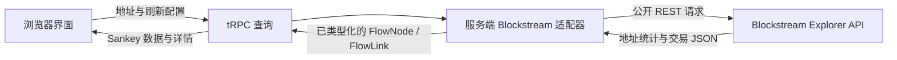

# Bitcoin Flow Monitor

**Bitcoin Flow Monitor** 是一个开源的比特币地址交易流向查看器。输入任意主网 BTC 地址后，应用会通过公开的 Blockstream Explorer REST API 查询最新地址统计与交易记录，并以交互式桑基图展示 **输入地址 → 交易 → 输出地址** 的 UTXO 数据关系。

> 本项目是区块链数据可视化工具，不构成投资、交易、合规或地址归属判断建议。比特币交易的输入与输出关系并不能单独证明资金控制权、实体身份、付款人、收款人或找零归属。

## 功能概览

| 功能 | 说明 |
| --- | --- |
| 地址检索 | 接收主网 BTC 地址，查询地址统计与最新关联交易。 |
| 交互式桑基图 | 以蓝色输入节点、琥珀色交易节点和绿色输出节点，搭配可悬停的资金色带展示 UTXO 流。 |
| 交易详情 | 显示 TXID、确认状态、区块高度、时间、手续费、输入与输出金额。 |
| 自动刷新 | 页面打开期间按用户选择的间隔重新拉取数据，默认 30 秒；可关闭或设为 15、60、120 秒。 |
| Apple 风格界面 | 使用 Inter / SF Pro 字体栈、半透明磨砂卡片、圆角、柔和阴影与深浅主题切换。 |
| 无密钥数据源 | 优先使用 Blockstream.info，并在其响应超时或不可达时自动切换至 Blockchain.info；不收集或保存地址、交易或账户数据。 |

## 快速开始

### 前置条件

请准备 Node.js 22 或更新版本，以及 pnpm 10 或更新版本。应用不需要区块链节点、API Key 或钱包连接。

### 安装与运行

```bash
git clone https://github.com/your-account/bitcoin-flow-monitor.git
cd bitcoin-flow-monitor
pnpm install
pnpm dev
```

开发服务器启动后，打开终端显示的本地地址。将有效的主网 BTC 地址粘贴至搜索框并点击“查询链上流向”。应用会从服务端代理访问 Blockstream.info，并在必要时切换至 Blockchain.info，因此浏览器不会直接面对跨域差异。

### 质量检查

```bash
pnpm check
pnpm test
pnpm build
```

## 使用说明

查询成功后，顶部统计卡会显示该地址的当前链上余额、已确认交易数量、内存池交易数量和查询窗口内的交易数。桑基图的左、中、右三列分别对应交易输入地址、交易本身和输出地址。将指针移动到色带上可查看该笔输入或输出的 BTC 金额；点击交易节点或下方交易行即可切换右侧详情面板。

自动刷新仅在浏览器页面处于打开状态时生效，默认每 30 秒重新读取数据。选择不同间隔即可即时调整；关闭开关后，仍可使用“立即刷新”按钮手动更新。这种页面端刷新不会创建常驻后台任务，也不会在用户离开页面后继续请求数据。

## 数据源与限制

实现优先使用 Blockstream 的 `GET /address/:address` 和 `GET /address/:address/txs`，这两个接口分别提供地址汇总与按新到旧排序的交易历史。官方 Esplora 文档说明：地址交易历史端点最多返回 50 笔内存池交易及首批 25 笔已确认交易；交易对象含 `vin`、`vout`、手续费与确认状态字段，金额单位均为 satoshi。[1] 如果 Blockstream 在 6 秒内无响应或返回服务错误，服务端会自动改用 Blockchain.info 的 `rawaddr` 公开地址端点；该端点允许通过 `limit` 请求最近交易，并返回输入、输出、手续费和区块高度字段。[2]

为避免图表在高输入/输出交易中失去可读性，前端窗口最多显示 5 笔最新关联交易；每笔交易在图中保留金额最大的 6 个独立输入和 6 个独立输出，其余项目合并为“其他输入/输出”节点。详情面板仍显示该交易图中使用的端点汇总。交易费用使每笔交易的输入总额通常略高于输出总额。

公开 UTXO 图只能展示链上交易结构，不能可靠地将所有输出归因给某个输入地址。请不要据此识别个人、作出资产归属结论或进行高风险决策。

## 架构



| 层级 | 责任 |
| --- | --- |
| `client/src/pages/Home.tsx` | 管理查询表单、主题、刷新设置、加载/错误状态和交易详情选择。 |
| `client/src/components/SankeyDiagram.tsx` | 生成可访问的 SVG 桑基节点与曲线色带，区分输入、交易、输出三种角色。 |
| `server/blockstream.ts` | 在服务端调用无密钥 Blockstream API，并把原始交易转换为受限、类型化的流向模型。 |
| `server/routers.ts` | 提供输入验证后的公共查询过程；不要求登录。 |
| `server/blockstream.test.ts` | 验证摘要计算及三类节点、色带链接的转换结果。 |

## 仓库结构

```text
bitcoin-flow-monitor/
├── client/                 # React 用户界面与交互式可视化
├── server/                 # tRPC 服务与 Blockstream 数据适配器
├── drizzle/                # 预置数据库模式（当前无需保存链上数据）
├── .github/                # Pull Request 模板
├── CONTRIBUTING.md         # 贡献流程与数据处理原则
├── LICENSE                 # MIT 许可证
├── README.md               # 项目使用与架构说明
└── .gitignore              # 依赖、日志、密钥和构建产物忽略规则
```

## 贡献与许可

欢迎阅读 [CONTRIBUTING.md](./CONTRIBUTING.md) 后提交 Issue 或 Pull Request。项目使用 [MIT License](./LICENSE) 发布。

## 参考资料

[1]: https://github.com/Blockstream/esplora/blob/master/API.md "Blockstream Esplora HTTP API"
[2]: https://www.blockchain.com/api/blockchain_api "Blockchain.com Blockchain Data API"
